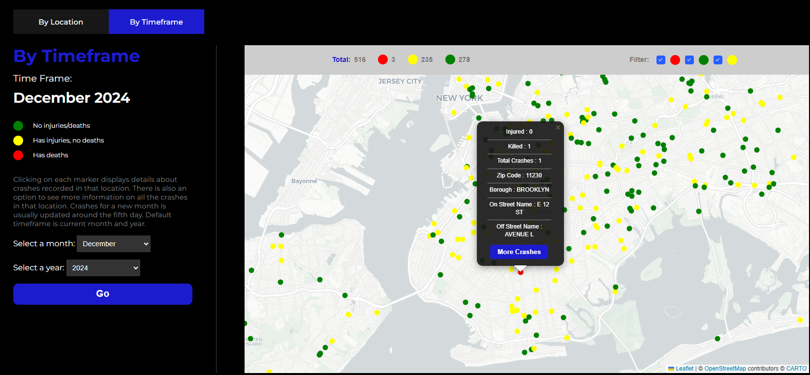

# NYC Road Risk Predictor

# Description
**A data visualization site that predicts the risk of vehicle collisions in specific areas around NYC. The app uses historical data and offers interactive visualizations to help identify high-risk areas**

# Goal
**We aim to raise awareness of these areas and provide data analysis to help officials operate on this data to reduce future vehicle accidents through traffic policy changes, road redesigns, additional traffic signs, and more**

# How It's Made
**Technologies Used: HTML, CSS, JavaScript, React, Leaflet.js, Chart.js, Python, Pandas, Flask, Virtual Environment**  
**Dataset: [Motor Vehicles Collisions-Nyc Open Data](https://data.cityofnewyork.us/Public-Safety/Motor-Vehicle-Collisions-Crashes/h9gi-nx95/about_data)**

# Deployment
**Frontend: The site is deployed on Netlify and accessible [here](https://rad-unicorn-c6a72d.netlify.app/)**  
**Backend: PythonAnywhere**

# Features
1. **Integrated two maps into our website to enhance user experience by providing an intuitive way to interact with the data and visualize crash locations. They convey detailed information about each specific location**
2. **Two sections of charts and graphs. One section displays information for the latest 10 years and the other section allows users to select and compare two years of their choice**
3. **The maps and charts & graphs are automated using GitHub Actions**

# Preview
### Cover Page

### One of the maps

